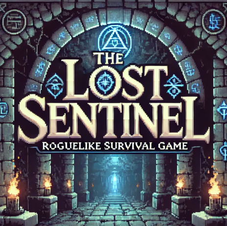
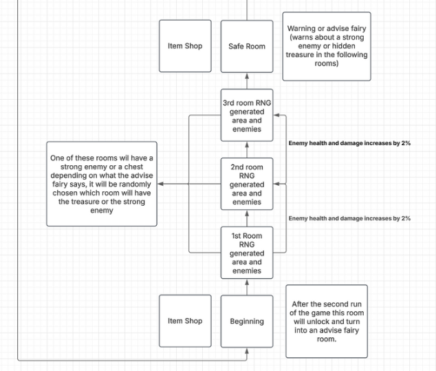
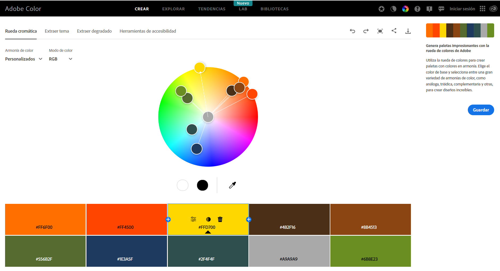
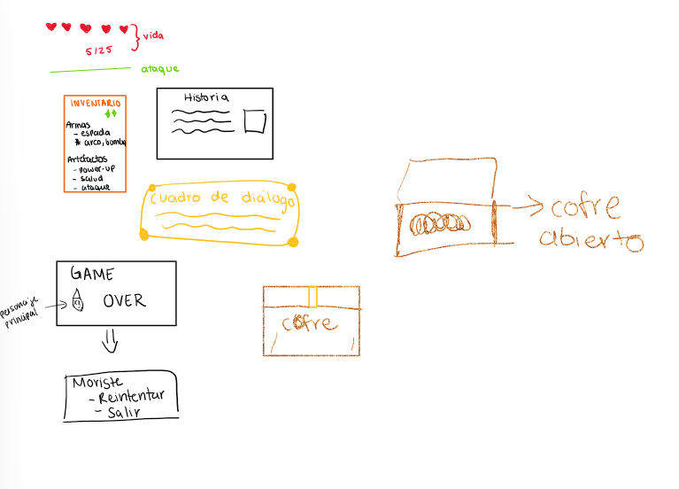

# **The Lost Sentinel**

## _Documento de Diseño de Juego_

---

### **Aviso de derechos de autor / información del autor**

- Amilka Daniela Lopez Aguilar A01029277
- Emiliano Deyta Illescas A01785881
- Jin Sik Yoon A01026630

TeamLink

Team Link logo

---

## **Índice**

1. [Índice](#índice)
2. [Diseño del Juego](#diseño-del-juego)
   1. [Resumen](#resumen)
   2. [Jugabilidad](#jugabilidad)
   3. [Mentalidad del Jugador](#mentalidad-del-jugador)
3. [Aspectos Técnicos](#aspectos-técnicos)
   1. [Pantallas](#pantallas)
   2. [Controles](#controles)
4. [Mecánicas](#mecánicas)
5. [Diseño de Niveles](#diseño-de-niveles)
   1. [Temas](#temas)
      1. [Ambiente](#ambiente)
      2. [Objetos](#objetos)
         1. [Ambientales](#ambientales)
         2. [Interactivos](#interactivos)
      3. [Desafíos](#desafíos)
6. [Flujo del Juego](#flujo-del-juego)
7. [Desarrollo](#desarrollo)
   1. [Clases Abstractas](#clases-abstractas)
   2. [Clases Derivadas](#clases-derivadas)
8. [Gráficos](#gráficos)
   1. [Atributos de Estilo](#atributos-de-estilo)
   2. [Gráficos Necesarios](#gráficos-necesarios)
9. [Sonidos/Música](#sonidosmúsica)
   1. [Atributos de Estilo](#atributos-de-estilo-1)
   2. [Sonidos Necesarios](#sonidos-necesarios)
   3. [Música Necesaria](#música-necesaria)
10. [Cronograma](#cronograma)

---

## **Diseño del Juego**

### **Resumen**

_The Lost Sentinel_ combina exploración estilo Zelda con mecánicas de progresión RPG. 
Los jugadores pueden explorar un mundo abierto, enfrentar combates en tiempo real, resolver acertijos escondidos e interactuar con NPCs para completar misiones y recoger recompensas.

--

The lost Sentinel Start Page

--

#### **Objetivo Principal:**
El jugador toma el rol de Sentinel, un guerrero que despierta en una mazmorra misteriosa sin recordar cómo llegó ahí. Guiado por un anciano NPC y un hada, Sentinel debe escapar de la mazmorra, descubrir la verdad detrás del **Ejército de la Oscuridad** y derrotar al jefe final antes de que sea demasiado tarde.

**A lo largo del juego, los jugadores podrán:**
- Combatir enemigos cada vez más difíciles en 10 habitaciones desafiantes.
- Interactuar con NPCs que ofrecen misiones, pistas y objetos.
- Mejorar armas, armaduras y habilidades en tiendas y cofres ocultos.
- Derrotar jefes poderosos que protegen la salida de la mazmorra.

---

### **Jugabilidad**

#### **Prólogo**

La oscuridad se disipa. Sentinel despierta en un frío suelo de piedra, con el eco de gotas cayendo a su alrededor. La tenue luz de una antorcha ilumina la cueva.  
Se siente débil, sin recuerdos de cómo llegó allí.  
Un anciano se le acerca. **"Por fin has despertado, joven héroe"**, dice con voz firme.  
Le advierte que su familia ha sido capturada por el **Ejército de la Oscuridad** y que necesita un arma para enfrentarlo.  
**"Sal de la cueva y busca a mi compañero. Él te dará una espada."**  
A pesar de la incertidumbre, Sentinel siente una fuerza desconocida dentro de él.  
Toma la espada de madera y da su primer paso hacia la oscuridad. La verdadera prueba ha comenzado. 

#### **Paso 1 (Terminando el cuarto 3)**

Sentinel encuentra una inscripción en la pared. Al tocarla, un recuerdo borroso regresa:
Gritos. Llamas. Una sombra con una espada oscura. Sentinel, herido, escucha una voz susurrar:
**"Corre… eres nuestra última esperanza."**

#### **Paso 2 (Terminando el cuarto 6)**

Un guardián espectral lo confronta:
**"Tú y el Rey Sombrío… son hermanos."**

#### **Paso 3 (Terminando el cuarto 9)**

Sentinel encuentra una espada negra clavada en un altar. Una visión lo golpea:
**Su hermano, herido, acepta un pacto con la Oscuridad para obtener poder absoluto.**

#### **Paso final (Entrando el cuarto de jefe)**

Jefe Final: El Rey Dragón (su hermano perdido)
**"¿Aún luchas por ellos? Solo yo vi la verdad."**

#### **Epílogo**

Sentinel observa el cuerpo de su hermano caer al suelo, la energía oscura disipándose lentamente en el aire. Durante un instante, el silencio lo envuelve. Todo ha terminado.
Pero en su corazón, no hay alivio, solo vacío. La verdad pesa más que la victoria. Él no era un simple guerrero en una mazmorra… era el hermano del Rey Dragón.
Con la espada aún en su mano, mira a su alrededor. La mazmorra, que antes parecía un laberinto sin salida, ahora es solo un cascarón vacío. ¿Para esto había luchado?

#### **Mentalidad del Jugador**

- El jugador se sentirá débil al inicio, ya que las armas disponibles pueden no ser lo suficientemente fuertes para derrotar a todos los enemigos.
- Tendrá que ser astuto y perseverante para conseguir mejores objetos en la tienda y así avanzar en más niveles del juego.
- Conseguir ventajas servirá como una forma de compromiso e incentivo para que el jugador siga intentando completar el nivel.

---

## _Technical_

---

## **Aspectos Técnicos**

### **Pantallas**

- **Pantalla de Inicio:** Vista previa del mapa. Sentinel camina por la pantalla hasta que el jugador haga clic en el botón de inicio.
- **Pantalla de Historia:** Se muestra un resumen de la historia breve de cómo Sentinel terminó en la mazmorra.
- **Opciones:**
  - El botón de inicio solicitará al jugador que inicie sesión con su nombre de usuario.
  - Pantalla de controles con las teclas de dirección, clic izquierdo, 'Q' y 'Z'.
- **Juego:**
  - **Inventario:** Pantalla con imágenes de todos los objetos recolectados y monedas acumuladas.
  - **Evaluación / Siguiente Nivel:** Pantalla negra que muestra cambios en el tiempo y entorno.
  - **Game Over:** Pantalla negra con el mensaje "Game Over" y un botón para reiniciar.
  - **Pantalla de Mazmorra**
  - **Salida de la mazmorra:** Iluminación natural, mapa con arbustos y suelo amarillo de concreto.
  - **Créditos Finales:** Nombres de los creadores y referencias en formato APA.

### **Controles**

**Movimiento**

- ⬆️ Flecha Arriba → Mover a la siguiente habitación (si la puerta está abierta).
- ⬇️ Flecha Abajo → Regresar a una habitación anterior.
- ⬅️ Flecha Izquierda → Moverse lateralmente en la habitación o entrar en puertas a la izquierda.
- ➡️ Flecha Derecha → Moverse lateralmente en la habitación o entrar en puertas a la derecha.

**Combate**

- **"Z"** → Ataque con espada.
- **"X"** → Disparo con arco.
- **"A"** → Colocar bomba (explota tras unos segundos).
- **”C”** → Ataque con magia.
- **”SHIFT”** → Defender con escudo.

**Interacción**

- **Clic Izquierdo** → Interactuar con NPCs, objetos o abrir cofres.
- **"I"** → Abrir inventario.  
- **"ESC"** → Abrir menú de pausa.

---

### **Mecánicas**

#### 1. Distribución de Habitaciones y Mazmorra
- La mazmorra consta de **10 habitaciones** que el jugador debe atravesar para progresar.
- Cada habitación puede tener diferentes diseños, obstáculos, enemigos e interacciones.
- Las habitaciones **3, 6 y 9** contienen:
  - **NPCs** que dan información útil.
  - **Tiendas de objetos** donde se pueden mejorar habilidades y equipamiento.
  - **Hadas consejeras** que ofrecen pistas sobre desafíos futuros.
- Algunas habitaciones contienen **tesoros ocultos** con recompensas valiosas.
- En la última habitación, el jugador se enfrentará a un **jefe poderoso** y podrá obtener un **tesoro especial**.

##### **Progresión de Habitaciones**
- El jugador avanza presionando la **Flecha Arriba** cuando está frente a la **puerta de salida**.
###### Habitaciones:
Habitaciones 1-3: Introducción al combate y mecánicas básicas.
Habitaciones 4-6: Enemigos más agresivos, trampas y acertijos.
Habitaciones 7-9: Múltiples enemigos en una misma sala, emboscadas.
Habitación 10: Batalla contra el Jefe Final.
- En los pisos de descanso, puede moverse lateralmente:
 - **Izquierda** → Tienda del anciano.
 - **Derecha** → Reino del hada.

---

#### 2. Mecánicas de Combate y Enemigos

##### **Enemigos**
- Cada habitación contiene al menos **un enemigo**, que el jugador debe derrotar antes de avanzar.
- A medida que el jugador progresa:
  - Los enemigos se **vuelven más fuertes**.
  - Ganan **más velocidad** y nuevas habilidades.

##### **Mecánicas de Combate**
- **Ataque**: Los jugadores pueden derrotar enemigos usando su **arma equipada**. El daño depende de sus estadísticas.
- **Salud**: El jugador tiene una **barra de vida**. Si llega a **0**, muere y debe **reiniciar desde el principio**.

##### **Uso de Objetos en Combate**
- Los jugadores pueden recolectar:
  - **Pociones de curación** que restauran vida.
  - **Objetos de mejora** para fortalecer atributos o armas.
  - **Ítems especiales** que pueden cambiar la estrategia de juego.

---

#### 3. NPCs - Asistencia de Hadas
- En las habitaciones **3, 6 y 9**, hay **hadas consejeras** que:
  - Dan pistas sobre desafíos futuros.  
    _Ejemplo_: "¡Ten cuidado! ¡El próximo enemigo es muy fuerte!"
  - Proporcionan información sobre **tesoros ocultos**.
  - En ocasiones, pueden **recompensar al jugador** con objetos útiles.

---

#### 4. Misiones y Trama

##### **Misión Principal**
- El jugador debe **escapar de la mazmorra** completando la historia principal.
- A lo largo de la aventura, descubrirá el **misterio del Ejército de la Oscuridad** y su relación con Sentinel.

##### **Misiones Secundarias**
- **Tesoros ocultos**: Pueden desbloquear **objetos especiales** o mejoras permanentes.
- Algunas misiones pueden involucrar **enfrentamientos adicionales** con enemigos desafiantes.

---

#### 5. Muerte Permanente y Reinicio
- Al **morir**, el jugador **reinicia desde la primera habitación**.
- Pierde la mayoría de sus recursos, pero conserva:
  - Su **espada inicial**.
  - **Algunas monedas** acumuladas en la partida.
- Esta mecánica obliga a los jugadores a:
  - **Planificar estratégicamente** el uso de recursos.
  - Mejorar su equipo y habilidades para **progresar más en cada intento**.

---

## _Diseño de Niveles_

---

### **Temas**

### 1. Cámaras de la Mazmorra

#### **Ambiente**
- Oscuro, sombrío, opresivo y desafiante.

#### **Objetos**
##### **Ambientales**
- Iluminación tenue con **antorchas brillantes**.
- Estructuras de **piedra envejecida** con suelo sucio.
- Sonidos de **escombros crujientes** al caminar.
- **Bloques de piedra** y **pilares antiguos**.
- **Puertas representadas como áreas huecas y negras** en los límites de la cámara.

##### **Interactivos**
- **Puertas con mecanismos ocultos** que deben activarse para abrirse.
- **NPCs misteriosos** que ofrecen advertencias o pistas crípticas.
- **Trampas ocultas** con picos que infligen daño si el jugador cae en ellas.
- **Cofres escondidos** que contienen monedas o armas mejoradas.

---

### 2. Tienda de Objetos _(Tienda del Anciano)_

#### **Ambiente**
- Un espacio **acogedor, tranquilo y cálido**, donde el jugador se siente **seguro**.

#### **Objetos**
##### **Ambientales**
- **Más iluminado** que la mazmorra, con luces cálidas y tenues.
- **Estantes de madera antiguos**, llenos de objetos curiosos, armas y pociones.
- **Suelos de madera chirriantes** que añaden una sensación de rusticidad.
- Un **gato dormido** en la esquina, aportando un toque de vida.

##### **Interactivos**
- **El anciano se enoja** si el jugador intenta tocar sus objetos sin pagar.
- Si el jugador intenta **robar tres veces**, el anciano lo expulsa de la tienda.
- El jugador puede **comprar objetos de curación, mejoras de armas y habilidades** _(HP, Atk, Def, etc.)_.

---

### 3. Reino de las Hadas

#### **Ambiente**
- Un lugar **misterioso, de cuento de hadas, mágico y enigmático**.

#### **Objetos**
##### **Ambientales**
- **Luz natural** filtrándose entre los árboles, creando un ambiente sereno.
- **Rocas cubiertas de musgo flotando** en el aire, aumentando el aire de fantasía.

##### **Interactivos**
- Si el jugador intenta **atacar a un hada**, el entorno se **vuelve rojizo y amenazante**.
- **Posibilidad de encontrar cofres** con monedas o artefactos únicos.
- Algunas hadas ofrecen **pistas sobre enemigos poderosos** o tesoros ocultos.
- En ciertos encuentros, el jugador puede **verse obligado a luchar contra hadas hostiles**.

### **Flujo del Juego**

## **Flujo del Juego**

### **Introducción y Menú de Inicio**
1. El juego comienza con una **pantalla de título**, donde Sentinel camina a través de la pantalla.
2. El jugador debe hacer clic en el **botón "Inicio"** para continuar.
3. Aparece la **pantalla de inicio de sesión**, donde el jugador ingresa su nombre de usuario.
4. Una vez que inicia sesión, el jugador es llevado a la **Pantalla de Historia**.

---

### **Pantalla de Historia y Prólogo**
1. Un **prólogo corto** se desplaza de arriba hacia abajo, presentando la historia del juego.
2. La pantalla **se desvanece a negro** y da paso a la **primera escena jugable**.

---

### **Despertar en la Mazmorra**
1. Sentinel despierta **inconsciente** en una cámara oscura de piedra.
2. Aparece una pantalla con el **tutorial de controles**:
   - **⬆️⬇️⬅️➡️ Flechas del teclado** → Moverse por el mapa.
   - **"Z"** → Ataque básico con espada.
   - **"X"** → Ataque con arco.
   - **"A"** → Colocar una bomba.
   - **”C”** → Ataque con magia.
   - **”SHIFT”** → Defender con escudo.
   - **Click Izquierdo** → Interactuar con objetos/NPCs.
   - **"I"** → Abrir inventario.
   - **"ESC"** → Abrir el menú de pausa.
3. Sentinel **conoce a un NPC anciano**, quien le explica su misión.
4. El anciano le entrega **una espada de madera** como su primera arma.
5. El jugador puede **explorar la mazmorra** e interactuar con NPCs.

---

### **Explorando la Mazmorra**
La mazmorra tiene **10 cámaras**, cada una con:
- **Enemigos** de dificultad creciente.
- **Tiendas** donde el jugador puede comprar mejor equipo.
- **NPCs**, incluidas hadas que dan consejos o advertencias.
- **Habitaciones ocultas** con tesoros o desafíos adicionales.

---

### **Primer Encuentro con un Enemigo**
1. El jugador entra en una habitación y **se enfrenta a su primer enemigo**.
2. Se introduce el **tutorial de combate**:
   - **"Z"** → Ataque con espada.
   - **Estrategias de movimiento** para esquivar ataques enemigos.
3. Al derrotar al enemigo, el jugador **recibe monedas** como recompensa.

---

### **Navegación en la Mazmorra**
El jugador avanza enfrentando:
- **Enemigos más fuertes** con nuevas habilidades.
- **Tiendas** para mejorar armas y armaduras.
- **Hadas consejeras**, que dan advertencias sobre peligros futuros.
- Cada **tres habitaciones**, se revelan **más detalles** sobre el pasado de Sentinel y los motivos del villano principal.

---

### **Visitación a la Tienda y al Reino de las Hadas**
En las habitaciones **3, 6 y 9**, el jugador puede **visitar**:
   - **Tienda** para comprar ítems con las monedas obtenidas.
   - **Reino de las Hadas** para recibir pistas y objetos mágicos.

---

### **Batalla contra el Jefe Final y Créditos**
1. En la **décima habitación**, el jugador se enfrenta a un **jefe poderoso**.
2. Si el jugador gana, se muestra una **escena final** de la historia.
3. Aparecen los **créditos finales**, que incluyen:
   - **Retratos de los personajes**.
   - **Nombres de los desarrolladores**.
   - **Créditos de la música y efectos de sonido**.

# **Desarrollo**

---

# **Clases Abstractas**

## **BaseEntity**
Clase padre para todas las entidades del juego (jugadores, enemigos, NPCs, objetos interactivos).  
Define propiedades básicas como posición, movimiento y renderizado.

### **Atributos:**
- `position (x, y)`: Define las coordenadas de la entidad en el mundo del juego.
- `sprite`: Representación visual de la entidad basada en los assets disponibles.
- `velocity`: Velocidad de movimiento de la entidad.
- `hitbox`: Área de colisión de la entidad, definida según su tamaño en píxeles.

### **Métodos:**
- `update()`: Actualiza la posición y el estado de la entidad.
- `render()`: Dibuja la entidad en la pantalla.
- `collide(other_entity)`: Verifica la colisión con otra entidad.

---

## **BaseCharacter**
Representa a todos los personajes (jugador, NPCs y enemigos).  
Maneja la salud, el movimiento y las animaciones.

### **Atributos:**
- `health`: Puntos de vida del personaje.
- `damage`: Cantidad de daño que el personaje puede causar.
- `speed`: Velocidad de desplazamiento en píxeles por segundo.
- `inventory`: Lista de objetos que el personaje posee.
- `attack_type`: Define el tipo de ataque que usa (espada, arco, magia, etc.).

### **Métodos:**
- `move(direction)`: Mueve el personaje en una dirección específica.
- `attack(target)`: Realiza un ataque contra otra entidad.
- `take_damage(amount)`: Reduce la salud en función del daño recibido.
- `interact(object)`: Permite la interacción con objetos o NPCs.
- `change_sprite(state)`: Cambia la animación del personaje dependiendo de su estado (ej. dañado).

---

## **BaseEnemy**
Representa a los enemigos dentro del juego, extendiendo las funcionalidades de **BaseCharacter**.

### **Atributos:**
- `ai_behavior`: Define la estrategia de ataque o movimiento del enemigo.
- `detection_range`: Rango en píxeles dentro del cual el enemigo detecta al jugador.
- `attack_pattern`: Patrón de ataque único según el tipo de enemigo.
- `resistance`: Modificadores de daño según el tipo de ataque recibido.
- `drop_loot`: Objetos o monedas que puede soltar al ser derrotado.

### **Métodos:**
- `chase(player)`: Persigue al jugador si entra en su rango de detección.
- `attack()`: Ejecuta un ataque según su patrón predefinido.
- `flee()`: Si su salud cae por debajo de cierto umbral, el enemigo intentará escapar o cambiar su patrón de ataque.
- `take_damage(amount, type)`: Reduce la salud del enemigo y puede modificar su IA si está herido.

**Ejemplo de Aplicación con Assets:**
- `Aquamentus` (Jefe Final) tiene **patrones de ataque con proyectiles y cambio de color cuando está herido**.
- `Darknut` tiene **resistencia a ataques frontales** y **solo es vulnerable por la espalda**.
- `Keese` es **rápido, con vuelo errático y ataques impredecibles**.

---

## **BaseObject**
Representa todos los objetos con los que se puede interactuar (puertas, cofres del tesoro, interruptores).

### **Atributos:**
- `is_interactable`: Determina si el objeto puede ser interactivo.
- `state`: Estado del objeto (cerrado, abierto, activado, desactivado).
- `effect`: Si el objeto tiene un efecto especial al usarse.

### **Métodos:**
- `trigger()`: Activa un efecto cuando el objeto es interactuado.
- `change_state(new_state)`: Cambia el estado del objeto, por ejemplo, abrir un cofre.

**Ejemplo de Aplicación con Assets:**
- **Cofres** pueden estar **cerrados o abiertos**, conteniendo recompensas o trampas.
- **Puertas** pueden **bloquearse hasta que todos los enemigos sean derrotados**.

---

## **BaseItem**
Representa todos los objetos coleccionables (armas, pociones, objetos de misión).

### **Atributos:**
- `effect`: Define el impacto del objeto (curación, aumento de daño, etc.).
- `stackable`: Determina si el objeto puede acumularse en el inventario.

### **Métodos:**
- `use(player)`: Aplica el efecto del objeto al jugador.

**Ejemplo de Aplicación con Assets:**
- **Pociones de vida** restauran **una cantidad fija de HP**.
- **Llaves** permiten **desbloquear puertas o cofres ocultas en mazmorras**.
- **Gemas mágicas** pueden **potenciar hechizos o desbloquear zonas ocultas**.

---

## **BaseWeapon**
Define las propiedades de diferentes armas en el juego.

### **Atributos:**
- `damage`: Potencia de ataque.
- `range`: Alcance del arma.
- `attack_speed`: Velocidad de ataque (tiempo entre golpes).
- `durability`: Número de veces que el arma puede ser usada antes de romperse.

### **Métodos:**
- `swing()`: Realiza un ataque cuerpo a cuerpo.
- `shoot()`: Dispara un proyectil (para arcos, varas mágicas, etc.).
- `break()`: Si la durabilidad llega a 0, el arma se destruye.

**Ejemplo de Aplicación con Assets:**
- **Espadas (Wooden Sword, White Sword, Magical Sword)** tienen **diferentes niveles de daño y velocidad**.
- **Varas mágicas (Magical Rod)** permiten **atacar con proyectiles mágicos a distancia**.
- **Escudos** pueden **bloquear ciertos ataques y reflejar proyectiles**. 

---

# **Clases Derivadas**

## **PlayerCharacter**
El personaje principal jugable, **Sentinel**, es controlado por el jugador.

### **Atributos:**
- `base_health = 100` → Salud base del personaje.
- `base_damage = 10` → Daño base con espada inicial.
- `speed = 3` → Velocidad estándar de movimiento.
- `inventory = []` → Inventario vacío al inicio del juego.
- `stamina = 50` → Resistencia para esquivar ataques y usar habilidades especiales.
- `magic = 0` → Poder mágico, aumenta con ciertos objetos.
- `defense = 5` → Reducción de daño recibido.
- `weapon_equipped = "Wooden Sword"` → Arma equipada por defecto.

### **Métodos:**
- `move(direction)`: Controla el movimiento del personaje.
- `attack(target)`: Realiza un ataque con el arma equipada.
- `take_damage(amount)`: Reduce la salud según el daño recibido.
- `use_item(item)`: Activa el efecto de un objeto del inventario.
- `block()`: Permite reducir el daño recibido al usar un escudo.
- `dodge()`: Usa **stamina** para esquivar ataques enemigos.

---

# **Enemigos**

Cada enemigo en el juego hereda de la clase **BaseEnemy**, adaptando su comportamiento y estadísticas según su tipo.

## **Atributos Comunes**
- `health`: Puntos de vida del enemigo.
- `damage`: Cantidad de daño que inflige.
- `speed`: Velocidad de movimiento y ataque.
- `type_of_attack`: Tipo de ataque utilizado (cuerpo a cuerpo, proyectiles, magia, embestida).
- `aggression_level`: Nivel de agresividad del enemigo (pasivo, defensivo, agresivo).
- `resistance`: Modificadores de daño según el tipo de ataque recibido.

## **Métodos Comunes**
- `chase(player)`: El enemigo persigue al jugador si está dentro de su rango de detección.
- `attack()`: Ejecuta un ataque específico según su tipo.
- `flee()`: Si su salud baja de cierto umbral, el enemigo intentará escapar o cambiar su patrón de ataque.
- `take_damage(amount, type)`: Recibe daño y cambia su comportamiento según el impacto.

---

## **Lista de Enemigos Actuales**

### **AQUAMENTUS (Jefe Final)**
- **Descripción:** Un poderoso dragón guardián que escupe bolas de fuego en ráfagas y protege la salida de la mazmorra.
- **Atributos:**
  - `health = 300`
  - `damage = 20`
  - `speed = 2`
  - `type_of_attack = "Fireball"`
  - `aggression_level = 5` (Extremadamente agresivo)
- **Habilidades Especiales:**
  - **Ráfaga de fuego**: Dispara múltiples bolas de fuego en un patrón en abanico.
  - **Furia dracónica**: Cuando su vida cae por debajo del 30%, aumenta su velocidad y la frecuencia de ataque.
  - **Resistencia mágica**: Recibe menos daño de ataques mágicos.

---

### **ZOL**
- **Descripción:** Criaturas gelatinosas que se arrastran lentamente por la mazmorra.
- **Atributos:**
  - `health = 20`
  - `damage = 5`
  - `speed = 1`
  - `type_of_attack = "Contact"`
  - `aggression_level = 1`
- **Habilidades Especiales:**
  - **División**: Al recibir un golpe fuerte, puede dividirse en dos criaturas más pequeñas.

---

### **KEESE**
- **Descripción:** Murciélagos pequeños que se mueven de manera errática.
- **Atributos:**
  - `health = 10`
  - `damage = 8`
  - `speed = 4`
  - `type_of_attack = "Dive"`
  - `aggression_level = 3`
- **Habilidades Especiales:**
  - **Vuelo errático**: Cambia de dirección impredeciblemente, dificultando el ataque del jugador.

---

### **STALFOS**
- **Descripción:** Guerreros esqueléticos que portan espadas y atacan con precisión.
- **Atributos:**
  - `health = 40`
  - `damage = 10`
  - `speed = 2`
  - `type_of_attack = "Sword Slash"`
  - `aggression_level = 3`
- **Habilidades Especiales:**
  - **Bloqueo con escudo**: Puede detener algunos ataques si está en posición de defensa.
  - **Salto esquivo**: Puede moverse bruscamente si el jugador lo ataca.

---

### **DARKNUT**
- **Descripción:** Caballeros fuertemente armados que solo pueden ser dañados por la espalda o los flancos.
- **Atributos:**
  - `health = 80`
  - `damage = 15`
  - `speed = 1`
  - `type_of_attack = "Heavy Sword Slash"`
  - `aggression_level = 4`
- **Habilidades Especiales:**
  - **Armadura pesada**: No recibe daño de ataques frontales.
  - **Carga con escudo**: Puede embestir al jugador si este se acerca demasiado.

---

### **WIZZROBE**
- **Descripción:** Magos oscuros que pueden teletransportarse y lanzar ataques mágicos a distancia.
- **Atributos:**
  - `health = 50`
  - `damage = 18`
  - `speed = 3`
  - `type_of_attack = "Magic Beam"`
  - `aggression_level = 4`
- **Habilidades Especiales:**
  - **Teletransporte**: Puede moverse de un lado a otro para evitar ser golpeado.
  - **Rayo arcano**: Lanza un hechizo de energía que atraviesa obstáculos.

---

## **NPCs**

### **Vendedor (Shopkeeper)**
Un anciano que administra la tienda del juego.

### **Atributos:**
- `dialogue = ["¡Bienvenido!", "¡No toques eso!", "Compra algo o vete."]`
- `inventory = [Poción de vida, Espada, Arco, Bomba]`

### **Métodos:**
- `sell_item(player, item)`: Transfiere un objeto al jugador a cambio de oro.
- `kick_out()`: Expulsa al jugador si intenta robar.

---

# **Objetos**

## **Espada (Sword)**
El arma estándar de combate cuerpo a cuerpo.

### **Atributos:**
- `damage = 10`
- `range = 1`
- `durability = 50`

### **Métodos:**
- `swing()`: Realiza un ataque con la espada.

---

## **Arco (Bow)**
Un arma de combate a distancia.

### **Atributos:**
- `damage = 5`
- `range = 7`
- `arrows = 10`

### **Métodos:**
- `shoot_arrow()`: Dispara una flecha.

---

## **Bomba (Bomb)**
Explota después de un tiempo determinado.

### **Atributos:**
- `damage = 15`
- `range = 3`
- `time = 3` segundos

### **Métodos:**
- `put_bomb()`: Coloca la bomba en el suelo.

---

## **Poción de Salud (Health Potion)**
Objeto consumible que restaura la salud del jugador.

### **Atributos:**
- `effect = "restore 30 HP"`

### **Métodos:**
- `use(player)`: Restaura la salud del jugador.

---

## **Barra de Magia (Magic Bar)**
Mide la cantidad de poder mágico del jugador. Se usa para habilidades especiales y armas mágicas.

### **Atributos:**
- `max_magic = 100`
- `current_magic = 100`
- `regen_rate = 1` → Regeneración automática por segundo.
- `magic_consumption = Variable` → Cada hechizo usa una cantidad distinta.

### **Métodos:**
- `use_magic(amount)`: Reduce la barra de magia según el hechizo utilizado.
- `restore_magic(amount)`: Recupera magia al recolectar ítems o esperar regeneración.

---

## **Barra de Escudo (Shield Bar)**
Representa la resistencia del escudo del jugador antes de romperse.

### **Atributos:**
- `max_shield = 50`
- `current_shield = 50`
- `block_reduction = 50%` → Reduce el daño recibido a la mitad.
- `break_threshold = 0` → Si la barra llega a 0, el escudo se rompe.

### **Métodos:**
- `block_attack(amount)`: Reduce la barra de escudo al recibir daño mientras se bloquea.
- `repair_shield(amount)`: Restaura la barra de escudo con ciertos ítems o en tiendas.

---

## **Cofre del Tesoro (Treasure Chest)**
Un cofre que contiene recompensas.

### **Atributos:**
- `contents = ["Oro", "Llave", "Armas", "Pociones de Magia", "Reparación de Escudo"]`

### **Métodos:**
- `open(player)`: Da un objeto aleatorio al jugador.

---

## **Puertas (Doors)**
Pasajes entre habitaciones.

### **Atributos:**
- `is_locked = True`

### **Métodos:**
- `block()`: Evita el acceso hasta que se derroten a los enemigos.

# **Gráficos**

---

## **Atributos de Estilo**

### **Color**
- Los tonos **tierra apagados** dominan el juego, con **marrones oscuros y grises** para las paredes de piedra de la mazmorra.
- Se contrastan con destellos ocasionales de luz de **antorchas en amarillos y naranjas cálidos**.
- **La tienda y el reino de las hadas** presentan colores más brillantes como **dorados, verdes y azules suaves**, generando una atmósfera más acogedora.
- Los **enemigos y jefes** utilizan tonos más oscuros con acentos **rojos o verdes espectrales** para enfatizar el peligro.

---

### **Textura**
- **Mazmorra:** Paredes **ásperas y agrietadas**, con un suelo de piedra **frío y rugoso**.
- **Tienda:** Estantes de madera **desgastados pero pulidos**, agregando calidez al entorno.
- **Reino de las hadas:** Texturas suaves como **agua cristalina, piedras cubiertas de musgo y follaje delicado**, contrastando con la dureza de la mazmorra.

---

### **Estilo Gráfico**
- **Arte en píxeles**, inspirado en los **RPG retro**.
- Personajes **expresivos** y entornos **detallados**.
- **Animaciones fluidas**, enfocadas en combate y resolución de acertijos.
- Se prioriza la **claridad visual** para que el jugador pueda identificar fácilmente objetos y NPCs interactivos.

---

### **Estilo de Animación**
- **Animaciones sutiles** para dar vida al entorno:
  - **Antorchas parpadeantes**
  - **Olas de agua en movimiento**
- **Animaciones de combate impactantes**, con efectos como:
  - **Cortes de espada**
  - **Explosiones**
- **NPCs y enemigos con transiciones fluidas** en interacciones:
  - **Diálogos**
  - **Ataques**
  - **Zooms o acercamientos cuando sea necesario**

---

### **Estilo de Iluminación**
- **Mazmorra:** Iluminación **tenue y atmosférica**, con **sombras parpadeantes** proyectadas por antorchas.
- **Tienda:** Más **brillante y cálida**, con luz superior **suave** iluminando los objetos.
- **Reino de las hadas:** Luz **natural filtrándose entre los árboles**.
  - **Cuando hay peligro, la iluminación cambia a tonos rojos ominosos**.

---

### **Estilo de Efectos de Sonido**
- **Sonidos ambientales minimalistas**, como:
  - **Ecos de pasos** en la mazmorra.
  - **Antorchas crepitando**.
  - **Gruñidos lejanos de enemigos**.
- **Efectos en la tienda:**
  - **Suaves tintineos de monedas**.
  - **Sonidos sutiles al mover objetos**.
- **Reino de las hadas:**
  - **Sonidos de agua y aves**.
  - **Cambios a tonos inquietantes cuando aparecen enemigos**.
- **Sonidos de combate impactantes:**
  - **Choques de espadas**.
  - **Rugidos de enemigos**.

---

### **Estilo de Música**
- **Mazmorra:** Sonidos **oscuros y envolventes**, con uso de **piano, cuerdas y percusión suave**.
- **Tienda:** Melodía **ligera y tranquila**.
- **Reino de las hadas:** Música **misteriosa y mágica**.
  - **En momentos de peligro, la música se vuelve más tensa**.

---

### **Estilo de UI (Interfaz de Usuario)**
- **Minimalista e intuitiva**.
- **Íconos en píxeles** para el inventario y la barra de salud.
- **Cuadros de texto claros**, sin bordes distractores.
- **Pantalla de inventario limpia**:
  - Objetos claramente etiquetados.
  - Monedas visibles.

---

### **Indicadores de Interactividad**
- **Objetos interactivos destacados** con:
  - **Brillo sutil** o contorno resaltado.
  - **Cambio en la textura**.
- **NPCs con indicaciones visuales:**
  - Aura o signos de **exclamación** cuando tienen información importante.
- **Combate:**
  - **Enemigos parpadean cuando están vulnerables o listos para atacar**.

---

# **Gráficos Necesarios**

---

## **Personaje Jugable**
- **Animación en reposo:** De pie sin moverse.
- **Animación de caminata:** Ciclo de **4 fotogramas** en todas las direcciones (arriba, abajo, izquierda, derecha).
- **Animación de ataque (Espada):** Animación de **corte** con **3 fotogramas**.
- **Animación de ataque (Arco):** Animación de **preparación y disparo** con **2 fotogramas**.

---

## **Enemigos**
- **Animación en reposo:** 2-3 fotogramas.
- **Animación de movimiento:** 3-4 fotogramas.
- **Animación de ataque:** 2-3 fotogramas.

---

## **NPCs**
### **Anciano Tendero**
- **Animación en reposo:** De pie detrás del mostrador.
- **Animación enojado:** **Rostro rojo**, tembloroso.

### **Hadas NPC**
- **Animación en reposo:** Flotando en su lugar.
- **Animación de hada enojada:** Se vuelve **roja y agresiva**.

---

## **Entorno y Tilesets**
### **Mazmorra**
- **Paredes:** Ladrillos de **piedra oscura con grietas**.
- **Suelos:** Baldosas variadas (**piedra, musgo, manchas de sangre**).
- **Puertas:** Abiertas o cerradas.
- **Antorchas con llamas encendidas**.

### **Tienda**
- **Paredes y suelos de madera**.
- **Estantes** llenos de **armas, pociones y pergaminos**.
- **Mostrador con monedas de oro esparcidas**.
- **Gato NPC sentado sobre un barril**.

### **Reino de las Hadas**
- **Paleta de colores brillantes en tonos azules y verdes**.
- **Árboles coloridos**.

---

## **Objetos Interactivos**
### **Cofres del tesoro**
- **Cofre cerrado**.
- **Cofre abierto**.

### **Puertas**
- **Puerta cerrada**.
- **Puerta abierta**.

---

## **Elementos de UI / HUD**
- **Barra de salud:** Corazones o barra segmentada.
- **Barra de resistencia:** Indicador verde debajo de la salud.
- **Pantalla de inventario:** Espacios para objetos (vacíos o llenos con **armas, pociones, monedas**).
- **Cuadro de diálogo:** Texto en arte pixelado.
- **Pantalla de Game Over:**  
  - **Fondo oscuro** con el mensaje **"Moriste "**.
  - Botones **"Reintentar" / "Salir"**.

  

---

# **Sonidos/Música**

---

## **Sonidos Necesarios**
- **Pasos suaves** (suelo de tierra).
- **Pasos más marcados** (suelo de piedra).
- **Aterrizaje suave** (baja velocidad de caída).
- **Aterrizaje fuerte** (alta velocidad de caída).
- **Vidrio rompiéndose**.
- **Apertura de cofre**.
- **Apertura de puerta**.

---

## **Retroalimentación de Jugador**
- **Sonido de alivio** (“Ahhhh!” al recuperar salud).
- **Sonido de impacto** (“Ooomph!” al ser atacado).
- **Campanilla alegre** (al obtener una vida extra).
- **Campanilla triste** (al morir).

---

# **Música Necesaria**

---

Utilizaremos la siguiente página web:
https://opengameart.org/

## **Pistas de fondo**
- **Pista de "bosque":**  
  - **Melodía de ritmo lento y tensa** para generar una sensación inquietante.
- **Pista de "castillo":**  
  - **Música emocionante** que refuerce la sensación de grandeza y peligro.
- **Pista de "mazmorra":**  
  - **Sonido lento y espeluznante** para aumentar la sensación de misterio y tensión.
- **Pista de créditos finales:**  
  - **Melodía alegre y satisfactoria** para cerrar la experiencia del jugador.

---

## **Easter Egg**
- **La canción #1 de Rick Astley:**
  - **"Never Gonna Give You Up"** como un **easter egg** o contenido especial dentro del juego.

---
# **Cronograma**

---

## **Fases de Desarrollo**
### **Desarrollo de Clases Base**
- **Entidad Base**
- **Jugador Base**
- **Enemigo Base**
- **Bloque Base**
- **Estado Base de la Aplicación**
  - **Mundo del juego**
  - **Mundo del menú**

---

## **Desarrollo de Características Principales**
- **Física y colisiones**
- **Optimización de controles y física**
- **Clases Derivadas**
  - **Bloques**: Móviles, Que caen, Que se rompen, Nube.
  - **Enemigos**: Soldado, Rata, Otros.
- **Diseño de niveles**
  - **Movimiento y saltos**
  - **Mecánica de lanzamiento**
  - **Ritmo de aprendizaje**
- **Sonidos y Música**
  - **Efectos de sonido**
  - **Banda sonora**

---

# **Plan Semanal**

## **Semana 1: Configuración Base y Controles**
### **Configuración del Proyecto**
- Creación de clases base: `BaseEntity`, `BaseCharacter`, `BaseObject`, `BaseItem`, `BaseWeapon`.
- Definir estructura de archivos y carpetas.
- Configuración del motor gráfico y sistema de colisiones.
- Implementación del loop de juego con renderizado y actualización.

### **Desarrollo del Jugador y Controles**
- Implementación de `PlayerCharacter`.
- Animaciones de caminar, atacar y recibir daño.
- Implementación de controles:
  - Movimiento (`teclas de dirección`).
  - Ataques básicos (`espada, arco`).
  - Uso de objetos (`inventario`).
- Implementación de colisiones con paredes y objetos.

---

## **Semana 2: Enemigos y Sistema de Combate**
### **Implementación de Enemigos**
- Creación de la clase `EnemyCharacter` con IA básica (`perseguir, atacar, patrullar`).
- Enemigos iniciales: `Ratas y Soldados Oscuros`.

### **Desarrollo del Sistema de Combate**
- Implementación de la mecánica de ataque y daño.
- Sistema de barra de salud y muerte de enemigos.
- Introducción de ataques cargados y golpes críticos.

---

## **Semana 3: Inventario, Tienda y Economía**
### **Sistema de Inventario**
- Creación del menú de inventario con casillas de objetos.
- Implementación del uso de objetos y armas.

### **Tienda del Anciano**
- Sistema de compra y venta de objetos.
- Restricciones por monedas y espacio en el inventario.
- Implementación de diálogos y mecánicas de interacción con NPCs.

---

## **Semana 4: Diseño de Niveles y Mazmorra**
### **Creación de Habitaciones**
- Implementación de `10 habitaciones principales` con diferentes distribuciones.
- Diseño de obstáculos, trampas y cofres con recompensas aleatorias.

### **Exploración y Progresión**
- Interacción con `puertas y mecanismos ocultos`.
- Activación de `trampas y acertijos ambientales`.

---

## **Semana 5: Jefe Final, Misiones y Eventos**
### **Jefe Final y Fases de Combate**
- Implementación de la IA del `Jefe Final` con ataques especiales.
- Ajuste de la dificultad y mecánicas de combate.

### **Misiones Secundarias y NPCs Adicionales**
- Implementación de misiones secundarias con recompensas ocultas.
- Incorporación del sistema de diálogos y pistas de la historia.

---

## **Semana 6: Pulido, Sonido y Balanceo**
### **Interfaz y HUD**
- Implementación de barra de salud, resistencia, minimapa y brújula.
- Indicadores de interactividad en objetos y NPCs.

### **Efectos Visuales y Sonido**
- Iluminación dinámica, partículas y efectos visuales avanzados.
- Sonidos ambientales, efectos de golpes y música de fondo.

### **Balance del Juego**
- Ajuste de dificultad, IA enemiga y velocidad de combate.
- Distribución estratégica de enemigos y cofres.

---

## **Semana 7: Pruebas, Optimización y Lanzamiento**
### **Corrección de Errores**
- Testeo de bugs en combate, exploración e inventario.
- Optimización del rendimiento (`carga de texturas, IA, colisiones`).

### **Últimos Ajustes y Publicación**
- Implementación de cinemáticas y pantalla de créditos.
- Ajustes finales en animaciones y efectos visuales.
- Preparación del juego para distribución y lanzamiento.